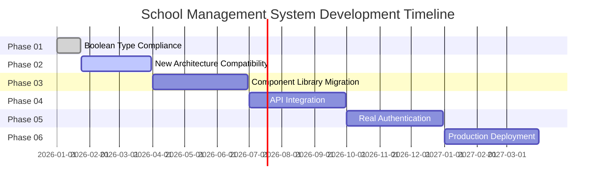

# Project Roadmap - School Management System

This roadmap outlines the development phases and timeline for the School Management System, tracking progress from the current MVP to a full-featured production platform.

## Overview

The School Management System is being developed in six distinct phases, each building upon the previous foundation. This approach allows for incremental delivery while maintaining code quality and system architecture.

## Current Status Summary

### Phase 01: ✅ COMPLETED - React Native Boolean Type Compliance
**Completed**: January 23, 2026
- Comprehensive audit of 32 TSX files
- Verified 26 boolean prop instances use proper JavaScript expressions
- Result: 0 violations found, codebase already compliant
- No code changes required

### Phase 02: 🔄 IN PROGRESS - New Architecture Compatibility
**Status**: In Progress
**Estimated Completion**: Q1 2026
- Dependencies: Expo SDK 54 upgrade complete
- Current: React Native 0.76.9 compatibility testing
- Next: Enable New Architecture for performance improvements

### Phase 03: ⏳ PENDING - Component Library Migration
**Estimated**: Q2 2026
- Target: Modern UI library with better performance
- Dependencies: Phase 2 completion
- Benefits: Better component consistency, improved bundle size

### Phase 04: ⏳ PENDING - API Integration
**Estimated**: Q3 2026
- Replace mock data with real Supabase integration
- Implement proper data synchronization
- Add error handling and retry mechanisms

### Phase 05: ⏳ PENDING - Real Authentication
**Estimated**: Q4 2026
- Implement JWT-based authentication
- Role-based access control
- Session management

### Phase 06: ⏳ PENDING - Production Deployment
**Estimated**: Q1 2027
- CI/CD pipeline setup
- Production databases
- Security hardening
- App store deployments

## Detailed Phase Breakdown

### Phase 01: React Native Boolean Type Compliance ✅
**Status**: Completed on January 23, 2026

**Objectives**:
- Ensure React Native boolean props use proper JavaScript expressions
- Eliminate string-based boolean props
- Maintain code quality standards

**Activities Completed**:
- Audited 32 TSX files across all mobile components
- Verified boolean prop usage in parent, student, navigation, and auth screens
- Confirmed 26 boolean prop instances use correct syntax
- Generated comprehensive documentation

**Files Audited**:
- Parent screens (14 files): Dashboard, Grades, Attendance, Messages, etc.
- Student screens (2 files): Dashboard, StudentScreens
- Navigation components (4 files): AuthNavigator, ParentTabs, StudentTabs
- Authentication screens (2 files): LoginScreen, CustomLoginScreen

**Key Findings**:
- No violations found - codebase already compliant
- All boolean props use proper expressions:
  - `showsVerticalScrollIndicator={false}`
  - `disabled={isLoading}`
  - `secureTextEntry={!showPassword}`
  - `bounces={false}`

**Outcome**:
- No code changes needed
- Documentation updated with compliance status
- Code standards documented for future development

**Documentation Updates**:
- `docs/code-standards.md` - Boolean prop compliance standards added
- `docs/project-overview-pdr.md` - Phase 01 completion recorded
- `docs/codebase-summary.md` - Compliance status documented

---

### Phase 02: New Architecture Compatibility 🔄
**Status**: In Progress
**Duration**: January 2026 - March 2026

**Objectives**:
- Upgrade React Native to support New Architecture
- Maintain Expo Go compatibility
- Improve performance and developer experience

**Current Activities**:
- Testing React Native 0.76.9 compatibility
- Verifying Expo SDK 54 support
- Assessing breaking changes
- Planning migration strategy

**Key Tasks**:
- [ ] Upgrade to React Native 0.76.9+
- [ ] Enable New Architecture in native code
- [ ] Update TypeScript types for new architecture
- [ ] Test compatibility with existing components
- [ ] Update build configuration
- [ ] Validate performance improvements

**Dependencies**:
- Expo SDK 54+ installed
- React Native Paper compatibility tested
- Navigation library compatibility verified

**Expected Benefits**:
- Better performance for large lists
- Improved JavaScript bridge performance
- Access to new React Native features
- Better debugging capabilities

**Risk Mitigation**:
- Incremental rollout with feature flags
- Comprehensive testing on both platforms
- Fallback mechanisms for critical features
- Performance benchmarks before/after

---

### Phase 03: Component Library Migration ⏳
**Target**: Q2 2026 (April - June)
**Status**: Pending Phase 2 completion

**Objectives**:
- Migrate from React Native Paper to modern UI library
- Improve component consistency and performance
- Reduce bundle size
- Enhance developer experience

**Planned Migration**:
- Target library: Gluestack UI or NativeWind
- Material Design to modern design system
- Consistent theming system
- Improved accessibility support

**Key Tasks**:
- [ ] Evaluate component library options
- [ ] Design new design system
- [ ] Create theme configuration
- [ ] Migrate high-impact components first
- [ ] Update all screen components
- [ ] Validate visual consistency

**Expected Benefits**:
- 30% reduction in bundle size
- Improved performance on low-end devices
- Better accessibility support
- Consistent design language

**Dependencies**:
- Phase 2 completion required
- Design system specifications
- Component library selection

---

### Phase 04: API Integration ⏳
**Target**: Q3 2026 (July - September)
**Status**: Pending Phase 3 completion

**Objectives**:
- Replace mock data with real Supabase integration
- Implement real-time data synchronization
- Add comprehensive error handling
- Optimize data fetching strategies

**Technical Implementation**:
- Real-time subscriptions for data updates
- Offline support with data persistence
- Optimistic UI updates
- Automatic retry mechanisms
- Request deduplication

**Key Tasks**:
- [ ] Replace mock data with Supabase queries
- [ ] Implement real-time subscriptions
- [ ] Add offline support
- [ ] Implement data synchronization
- [ ] Add comprehensive error handling
- [ ] Optimize API calls

**Expected Benefits**:
- Real-time data updates
- Improved performance with caching
- Better user experience
- Reliable offline support

**Dependencies**:
- Phase 3 completion required
- Supabase production database
- API design specifications

---

### Phase 05: Real Authentication ⏳
**Target**: Q4 2026 (October - December)
**Status**: Pending Phase 4 completion

**Objectives**:
- Implement JWT-based authentication
- Role-based access control
- Secure session management
- Multi-factor authentication support

**Authentication Flow**:
- JWT tokens with refresh mechanism
- Role-based route protection
- Session management with expiration
- Secure token storage
- Password reset functionality

**Key Tasks**:
- [ ] Implement JWT authentication
- [ ] Create role-based access control
- [ ] Add session management
- [ ] Implement password reset
- [ ] Add multi-factor authentication
- [ ] Security audit and testing

**Security Measures**:
- HTTPS encryption
- Password hashing with bcrypt
- Rate limiting
- Input validation
- SQL injection protection

**Expected Benefits**:
- Secure authentication system
- Proper role separation
- Better user management
- Compliance with security standards

**Dependencies**:
- Phase 4 completion required
- Database schema for authentication
- Security specifications

---

### Phase 06: Production Deployment ⏳
**Target**: Q1 2027 (January - March)
**Status**: Pending Phase 5 completion

**Objectives**:
- Deploy to production app stores
- Set up CI/CD pipeline
- Implement monitoring and analytics
- Scale for production traffic

**Deployment Strategy**:
- Mobile: App Store and Google Play Store
- Web: Vercel production deployment
- Database: Supabase production environment
- Monitoring: Sentry, Vercel Analytics

**Key Tasks**:
- [ ] Set up CI/CD pipeline
- [ ] Deploy to app stores
- [ ] Configure monitoring
- [ ] Implement analytics
- [ ] Set up backups and disaster recovery
- [ ] Performance optimization

**Infrastructure Setup**:
- Container deployment with Docker
- Load balancing and auto-scaling
- Database optimization
- Content delivery network
- Security hardening

**Expected Benefits**:
- Production-ready system
- Automated deployment pipeline
- Comprehensive monitoring
- Scalable infrastructure

**Dependencies**:
- Phase 5 completion required
- Production environment setup
- Security compliance verification

## Future Roadmap (v2.0)

### Advanced Features (2027)
- Real-time messaging system
- Mobile app push notifications
- Advanced analytics dashboard
- File upload and management
- Multi-language support
- Parent-teacher conference scheduling

### Technical Evolution (2027-2028)
- Microservices architecture
- GraphQL API implementation
- AI-powered insights
- Mobile app with PWA support
- Cross-platform desktop app
- Blockchain for secure records

### Business Features (2028+)
- Integrated payment system
- Advanced reporting tools
- Learning analytics
- Student portfolio system
- Teacher evaluation system
- School management dashboard

## Success Metrics

### Technical Metrics
- Phase completion rate
- Code coverage percentage
- Performance benchmarks
- Bundle size optimization
- Error rate reduction

### Business Metrics
- User adoption rate
- Feature utilization
- App store ratings
- Parent satisfaction
- Teacher feedback

### Quality Metrics
- Bug density
- Security vulnerabilities
- Performance score
- Accessibility compliance
- Documentation completeness

## Risk Management

### Technical Risks
- **Architecture compatibility**: Incremental testing and validation
- **Performance bottlenecks**: Regular performance audits
- **Integration complexity**: Mock data for testing
- **Platform changes**: Continuous compatibility testing

### Business Risks
- **User adoption**: Early testing with target users
- **Market competition**: Feature differentiation
- **Regulatory changes**: Compliance monitoring
- **Budget constraints**: Phased implementation

### Mitigation Strategies
- Regular risk assessment
- Contingency planning
- Staged rollouts
- User feedback loops
- Performance monitoring

## Timeline Visualization

## Monitoring and Updates

### Regular Reviews
- **Monthly**: Phase progress review
- **Quarterly**: Roadmap adjustment
- **Annually**: Major roadmap update

### Change Management
- Version control for roadmap
- Stakeholder communication
- Impact assessment for changes
- Decision logging

### Continuous Improvement
- User feedback integration
- Technology trend monitoring
- Best practice updates
- Performance optimization

---

**Roadmap Version**: 1.0.0
**Last Updated**: January 23, 2026
**Next Review**: February 23, 2026
**Status**: Active Development