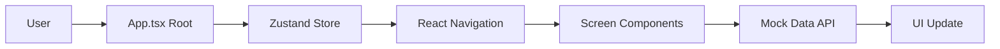
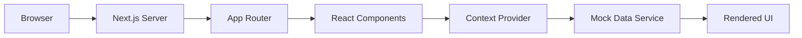
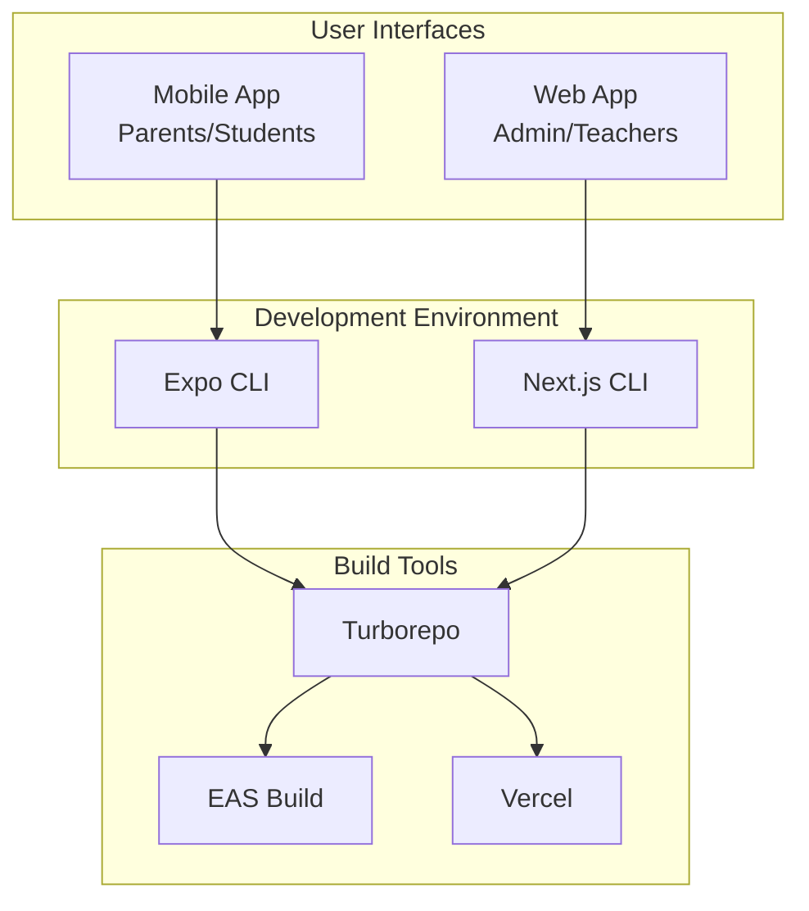
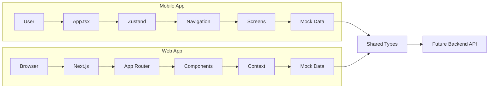

# System Architecture - EContact School Management

**Version**: 1.0
**Last Updated**: 2026-01-19
**Status**: Mobile Entry Point Configuration Fixed

## Overview

The EContact system is a comprehensive school management platform designed to streamline administrative workflows, enhance teacher efficiency, and improve communication between stakeholders.

## Architecture Overview

### Monorepo Structure

```
electric_contact_book/
├── apps/
│   ├── mobile/          # React Native + Expo (Parents/Students)
│   └── web/             # Next.js 15 (Admin/Teachers)
├── packages/
│   └── shared-types/    # TypeScript shared types
└── docs/               # Project documentation
```

## Application Architecture

### 1. Mobile Application (Parents/Students)

#### Tech Stack
- **Framework**: React Native 0.73.6
- **Platform**: Expo ~50.0.0
- **Navigation**: React Navigation 6.x (Custom implementation)
- **UI Components**: React Native Paper 5.x (Material Design)
- **State Management**: Zustand 4.x
- **Type Safety**: TypeScript 5.x
- **Asset Handling**: Expo Asset Bundle

#### Entry Points
- **Main Entry**: `./App.tsx` (RootNavigator)
- **Development Metro Server**: `npx expo start`
- **Build Command**: `npx expo prebuild`

#### Key Components
```typescript
// apps/mobile/App.tsx - Root Navigation
RootNavigator
├── AuthNavigator (Login, Register)
└── MainNavigator
    ├── Dashboard (9 Service Icons)
    ├── Schedule
    ├── Grades
    ├── Attendance
    ├── Payments
    ├── Messages
    ├── Notifications
    ├── News
    ├── Teachers
    └── LeaveRequests
```

#### Assets Configuration
- **Icon**: Default Expo icon or custom PNG
- **Splash Screen**: Expo default splash screen
- **Asset Bundle Patterns**: `**/*` (All files in assets dir)
- **Tablet Support**: iOS only, via app.json configuration

#### Project Structure
```
apps/mobile/
├── App.tsx                    # Root component & navigation
├── package.json              # Dependencies & scripts
├── app.json                  # Expo configuration
├── assets/                   # Images, icons, logos
│   ├── icon.png
│   ├── splash.png
│   └── README.md
├── src/
│   ├── screens/              # Screen components
│   ├── navigation/           # Navigation configs
│   ├── stores/               # Zustand stores
│   ├── theme/                # App theming
│   └── mock-data/            # Mock data files
└── tsconfig.json             # TypeScript config
```

### 2. Web Application (Admin/Teachers)

#### Tech Stack
- **Framework**: Next.js 15 (App Router)
- **Language**: TypeScript 5.x
- **Styling**: Tailwind CSS + shadcn/ui
- **State Management**: React Context + useReducer
- **Authentication**: Mock auth (expand to JWT/OAuth)
- **API Integration**: RESTful with mock data

#### Project Structure
```
apps/web/
├── app/
│   ├── (auth)/              # Authentication pages
│   ├── (admin)/             # Admin routes
│   ├── (teacher)/           # Teacher routes
│   └── api/                 # API routes
├── components/              # React components
├── lib/                     # Utilities & mock data
├── package.json             # Dependencies & scripts
└── tsconfig.json            # TypeScript config
```

#### Authentication Flow
```typescript
// Mock authentication system
Role Detection: Based on email prefix
- admin@... → Admin Portal
- teacher@... → Teacher Portal
- parent@... → Parent Portal (Future)
- student@... → Student Portal (Future)
Password: Any accepted (Mock)
```

## Shared Components & Types

### Shared Types Package
- **Location**: `packages/shared-types/`
- **Purpose**: Common interfaces, types, constants
- **Usage**: Import via `@school-management/shared-types`

### Design System
- **Primary Color**: #0284C7 (Sky Blue)
- **Typography**: Inter Font (Vietnamese support)
- **Components**: Consistent across platforms
- **Accessibility**: WCAG 2.1 AA compliant

## Data Flow

### Mobile App Data Flow


### Web App Data Flow


## Build & Deployment Architecture

### Mobile Build Pipeline
1. **Development**: `npx expo start` → Metro bundler
2. **Prebuild**: `npx expo prebuild` → Native codegen
3. **Build**: `npx eas build` → App binary
4. **Deploy**: App Store Connect / Google Play

### Web Build Pipeline
1. **Development**: `npm run dev` → Vite dev server
2. **Production Build**: `npm run build` → Static files
3. **Deploy**: Vercel / Static hosting

## Configuration Management

### Environment Variables
- **Development**: `.env.local`
- **Production**: Vercel/Expo environment variables

### Key Configuration Files
```typescript
// Mobile: apps/mobile/app.json
{
  "expo": {
    "name": "EContact School",
    "slug": "econtact-school",
    "orientation": "portrait",
    "userInterfaceStyle": "light",
    "assetBundlePatterns": ["**/*"],
    "ios": { "supportsTablet": true },
    "android": { "package": "com.schoolmanagement.econtact" }
  }
}

// Mobile: apps/mobile/package.json
{
  "main": "./App.tsx",
  "dependencies": {
    "@school-management/shared-types": "workspace:*",
    "expo": "~50.0.0",
    "react-native": "0.73.6"
  }
}
```

## Security Architecture

### Current State (Demo)
- **Authentication**: Mock auth (any password accepted)
- **Data**: Mock data only
- **API**: No real backend
- **Storage**: Local state only

### Production Security Plan
1. JWT authentication with refresh tokens
2. Input validation & sanitization
3. Rate limiting & DDoS protection
4. HTTPS with TLS 1.3
5. Audit logging system
6. Role-based access control (RBAC)

## Performance Optimization

### Mobile Optimizations
- **Code Splitting**: React Navigation lazy loading
- **Image Optimization**: Expo Image component
- **Bundle Analysis**: Metro inspector
- **Memory Management**: Proper cleanup in screens

### Web Optimizations
- **Static Site Generation**: Next.js SSG
- **Image Optimization**: Next.js Image component
- **Code Splitting**: Dynamic imports
- **Caching**: CDN & browser cache headers

## Monitoring & Analytics

### Development Monitoring
- **Metro Bundler**: Real-time error detection
- **React DevTools**: Component inspection
- **Expo Debugger**: Native debugging

### Production Monitoring (Future)
- **Error Tracking**: Sentry integration
- **Performance**: Lighthouse scores
- **User Analytics**: Mixpanel/Amplitude
- **APM**: New Relic/Dynatrace

## Future Architecture Evolution

### Phase 2: Backend Integration
```typescript
// Real API endpoints
/api/v1/auth/login
/api/v1/students
/api/v1/attendance
/api/v1/grades
/api/v1/notifications
```

### Phase 3: Real-time Features
- **WebSocket**: Live notifications
- **Push Notifications**: Mobile & Web
- **Live Attendance**: Real-time updates

### Phase 4: Advanced Features
- **Microservices**: Monolith → Services
- **GraphQL**: API modernization
- **Serverless**: AWS Lambda/Cloud Functions
- **Edge Computing**: CDN edge functions

## Entry Point Configuration Changes (2026-01-19)

### Issue Fixed
- **Problem**: Mobile app failed to start due to incorrect entry point configuration
- **Root Cause**: package.json pointed to `expo-router/entry` but used custom navigation
- **Solution**: Updated entry point to `./App.tsx` and configured asset handling

### Changes Made
1. **package.json**: Changed `"main"` from `"expo-router/entry"` to `"./App.tsx"`
2. **app.json**: Removed specific asset references, using Expo defaults
3. **Assets**: Created minimal placeholder files or used Expo's built-in assets

### Verification
- Metro bundler starts successfully
- No ConfigError messages
- App launches in Expo Go/dev client
- Navigation works correctly

## Architecture Diagrams

### High-Level System Architecture


### Data Flow Architecture


## Technical Debt & Improvements

### Current Technical Debt
1. **Authentication**: Mock auth needs replacement
2. **Data Layer**: Static mock data needs API integration
3. **State Management**: Centralized state needed for cross-app sync
4. **Testing**: No automated tests coverage

### Planned Improvements
1. **Type Safety**: Increase test coverage to 80%+
2. **Performance**: Bundle size optimization
3. **Accessibility**: Full WCAG 2.1 AA compliance
4. **Security**: Production-ready authentication

## Conclusion

The EContact system architecture provides a solid foundation for a school management platform with clear separation between mobile and web applications. The monorepo structure enables shared code and consistent development practices. The recent entry point configuration fix ensures the mobile app can start successfully, paving the way for continued feature development and eventual production deployment.