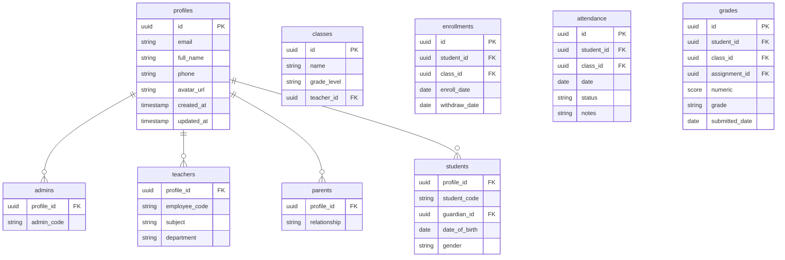

# System Architecture - School Management System

## Overview

The School Management System is built as a monorepo application with two primary client applications (mobile and web) and a shared backend infrastructure. The architecture is designed for scalability, maintainability, and performance while maintaining separation of concerns across different user roles.

## Architecture Diagram

```
┌─────────────────────────────────────────────────────────────────────────┐
│                            Load Balancer                                │
└─────────────────────────────┬───────────────────────────────────────────┘
                              │
                              ▼
┌─────────────────────────────────────────────────────────────────────────┐
│                         API Gateway                                    │
│  - Rate Limiting                                                       │
│  - Authentication                                                     │
│  - Request Logging                                                   │
│  - CORS Management                                                   │
└─────────────────────────────┬───────────────────────────────────────────┘
                              │
     ┌─────────────────────────┼─────────────────────────┐
     │                         │                         │
┌────▼─────────┐     ┌────────▼──────────┐     ┌────────▼──────────┐
│   Web App    │     │   Mobile App     │     │   Admin Portal   │
│   (Next.js)  │     │   (React Native) │     │   (Next.js)      │
└────┬─────────┘     └────────┬─────────┘     └────────┬─────────┘
     │                         │                         │
     └─────────────────────────┼─────────────────────────┘
                              │
                              ▼
┌─────────────────────────────────────────────────────────────────────────┐
│                          Backend Services                              │
│  ┌─────────────────────────┐  ┌─────────────────────────┐               │
│  │    Supabase Database    │  │   Supabase Storage    │               │
│  │   - PostgreSQL          │  │   - File Storage      │               │
│  │   - Realtime            │  │   - CDN              │               │
│  │   - Auth                │  │   - Image Processing  │               │
│  └─────────────────────────┘  └─────────────────────────┘               │
│                                                                         │
│  ┌─────────────────────────┐  ┌─────────────────────────┐               │
│  │   Edge Functions        │  │   External APIs       │               │
│  │   - Authentication     │  │   - Email Service     │               │
│  │   - Webhooks            │  │   - SMS Gateway       │               │
│  │   - Background Jobs     │  │   - Payment Gateway   │               │
│  └─────────────────────────┘  └─────────────────────────┘               │
└─────────────────────────────────────────────────────────────────────────┘
```

## Monorepo Structure

The project uses a monorepo structure with Turborepo for build orchestration:

```
electric_contact_book/
├── apps/                    # Applications
│   ├── mobile/             # React Native + Expo mobile app
│   │   ├── src/
│   │   │   ├── screens/    # Screen components
│   │   │   ├── navigation/ # Navigation setup
│   │   │   ├── stores/     # Zustand state management
│   │   │   ├── utils/      # Utility functions
│   │   │   └── types/      # TypeScript types
│   │   ├── App.tsx
│   │   └── package.json
│   └── web/                # Next.js web app
│       ├── app/           # App Router
│       │   ├── api/       # API routes
│       │   ├── (auth)/    # Auth routes
│       │   ├── (admin)/   # Admin routes
│       │   └── (teacher)/ # Teacher routes
│       ├── components/    # Reusable components
│       ├── lib/          # Utilities and config
│       └── package.json
│
├── packages/              # Shared packages
│   └── shared-types/      # TypeScript shared types
│
├── docs/                 # Documentation
├── plans/                # Implementation plans
└── .turbo/               # Turborepo configuration
```

## Application Architecture

### Mobile App (React Native + Expo)

#### Technology Stack
- **Framework**: React Native 0.76.9 with Expo SDK 54
- **Navigation**: React Navigation 7.x
- **UI Components**: React Native Paper 5.x (Material Design)
- **State Management**: Zustand
- **Authentication**: Supabase Auth
- **Database**: Supabase Realtime + PostgreSQL
- **Storage**: Supabase Storage
- **Code Quality**: ESLint with custom boolean props rules

#### Phase 1 Student Screen Implementation
The mobile app has been enhanced with a comprehensive set of student screens:

**Architecture Changes:**
- **Before**: Single `StudentScreens.tsx` component with tab-based navigation
- **After**: Dedicated screen components with stack navigation

**Screen Structure:**
- **Home Tab Stack**: 10 individual screens for academic features
- **Profile Tab Stack**: 6 screens for account management
- **Navigation Pattern**: Bottom tabs with headerless stack navigation

**Created Screens:**
- Schedule: Weekly class schedule with time periods
- Grades: Academic performance tracking with assignment details
- Attendance: Class attendance records and statistics
- StudyMaterials: Educational resources library
- LeaveRequest: Absence submission workflow
- TeacherFeedback: Communication interface for students
- News: School announcements and updates
- Summary: Consolidated academic overview
- Payment: Fee payment management and history

**Technical Implementation:**
- Consistent component naming: `Student{Feature}Screen`
- Export pattern via index file for clean imports
- TypeScript interfaces for type safety
- Mock data placeholders for Supabase integration

#### Component Architecture
```
App.tsx
├── AuthNavigator.tsx
│   ├── LoginScreen.tsx
│   └── CustomLoginScreen.tsx
├── ParentTabs.tsx
│   ├── Dashboard.tsx
│   ├── Grades.tsx
│   ├── Attendance.tsx
│   ├── Messages.tsx
│   ├── Notifications.tsx
│   ├── News.tsx
│   ├── TeacherDirectory.tsx
│   ├── LeaveRequest.tsx
│   ├── Schedule.tsx
│   ├── Summary.tsx
│   ├── PaymentOverview.tsx
│   ├── PaymentMethod.tsx
│   └── PaymentDetail.tsx
└── StudentTabs.tsx
    ├── Home Stack (Header Hidden)
    │   ├── StudentDashboard.tsx → DashboardScreen
    │   ├── StudentSchedule.tsx → ScheduleScreen
    │   ├── StudentGrades.tsx → GradesScreen
    │   ├── StudentAttendance.tsx → AttendanceScreen
    │   ├── StudentStudyMaterials.tsx → StudyMaterialsScreen
    │   ├── StudentLeaveRequest.tsx → LeaveRequestScreen
    │   ├── StudentTeacherFeedback.tsx → TeacherFeedbackScreen
    │   ├── StudentNews.tsx → NewsScreen
    │   ├── StudentSummary.tsx → SummaryScreen
    │   └── StudentPayment.tsx → PaymentScreen
    └── Profile Stack
        ├── ProfileScreen.tsx
        ├── UpdateProfileScreen.tsx
        ├── ChangePasswordScreen.tsx
        ├── BiometricAuthScreen.tsx
        ├── FAQScreen.tsx
        └── SupportScreen.tsx
```

#### State Management Pattern
```typescript
// Centralized store using Zustand
interface AuthState {
  user: User | null;
  isLoading: boolean;
  isAuthenticated: boolean;
}

const useAuthStore = create<AuthState>((set) => ({
  user: null,
  isLoading: false,
  isAuthenticated: false,
  // Actions
}));

// Screen-level state
const useDashboardData = () => {
  return useQuery({
    queryKey: ['dashboard'],
    queryFn: fetchDashboardData,
  });
};
```

### Web App (Next.js 15)

#### Technology Stack
- **Framework**: Next.js 15 with App Router
- **Runtime**: Node.js 18+
- **State Management**: React Query + Zustand
- **UI Components**: shadcn/ui with Tailwind CSS
- **Authentication**: NextAuth.js + Supabase
- **Database**: PostgreSQL with Supabase
- **Forms**: React Hook Form with Zod validation

#### Component Architecture
```
app/
├── layout.tsx                    # Root layout
├── page.tsx                      # Home page
├── (auth)/
│   ├── login/
│   │   └── page.tsx             # Login page
│   └── register/
│       └── page.tsx             # Register page
├── (admin)/
│   ├── dashboard/
│   │   └── page.tsx             # Admin dashboard
│   ├── users/
│   │   └── page.tsx             # User management
│   └── classes/
│       └── page.tsx             # Class management
├── (teacher)/
│   ├── dashboard/
│   │   └── page.tsx             # Teacher dashboard
│   ├── attendance/
│   │   └── page.tsx             # Attendance marking
│   └── grades/
│       └── page.tsx             # Grade management
└── api/                         # API routes
    ├── auth/
    ├── users/
    ├── classes/
    └── payments/
```

#### API Route Architecture
```typescript
// Dynamic API route
export async function GET(request: Request) {
  const { searchParams } = new URL(request.url);
  const page = searchParams.get('page');

  const users = await getUsers(parseInt(page) || 1);

  return Response.json(users);
}

// API route with middleware
export const POST = withAuth(async (req: Request) => {
  const userData = await req.json();

  // Validate input
  const validated = userSchema.parse(userData);

  // Create user
  const user = await createUser(validated);

  return Response.json(user, { status: 201 });
});
```

## Data Architecture

### Database Schema Overview


### Data Flow
1. **Authentication Flow**:
   ```
   User Login → Supabase Auth → JWT Token → Protected Routes
   ```

2. **Data Synchronization**:
   ```
   Client Request → API Gateway → Edge Functions → PostgreSQL
   ↑                            ↓
   Supabase Realtime ← Realtime Subscriptions
   ```

3. **File Storage**:
   ```
   File Upload → Supabase Storage → CDN Distribution
   ```

## Security Architecture

### Authentication & Authorization


### Security Measures
1. **Authentication**:
   - JWT-based authentication with refresh tokens
   - Role-based access control (RBAC)
   - Session management with expiration

   **Cookie Management** (Next.js App Router):
   - No cookie mutations allowed during GET requests (page rendering)
   - Cookie deletion only permitted in Server Actions (POST) or Route Handlers
   - Invalid sessions return null, redirect via `requireAuth()` helper
   - Recent fix: Removed `cookieStore.delete()` from `getUser()` to prevent App Router errors

2. **Data Protection**:
   - HTTPS encryption for all communications
   - Password hashing with bcrypt
   - Input validation and sanitization
   - SQL injection prevention

3. **API Security**:
   - Rate limiting (100 requests/minute)
   - CORS configuration
   - Request size limits
   - API key management for external services

## Performance Architecture

### Caching Strategy


### Optimization Techniques
1. **Web App**:
   - Next.js automatic code splitting
   - Static generation for static pages
   - ISR (Incremental Static Regeneration)
   - Image optimization with Next.js Image

2. **Mobile App**:
   - React Native FlatList for large data
   - Image caching and optimization
   - Lazy loading of components
   - Background data fetching

3. **API**:
   - Response caching with Redis (future)
   - Database query optimization
   - CDN for static assets
   - Compression (gzip/brotli)

## Monitoring & Observability

### Error Tracking
- **Sentry**: JavaScript error monitoring
- **Supabase Logs**: Database operation tracking
- **Custom Logging**: Application-specific events

### Performance Monitoring
- **Web Vitals**: Lighthouse CI integration
- **Bundle Analyzer**: Webpack size monitoring
- **React DevTools**: Component performance metrics

### Analytics
- **User Behavior**: Feature usage tracking
- **Performance**: API response time monitoring
- **Error Rates**: System health metrics

## Deployment Architecture

### CI/CD Pipeline


### Environment Strategy
1. **Development**: Local development with mock data
2. **Staging**: Replica of production for testing
3. **Production**: Live deployment with production database

## Future Architecture Considerations

### Scalability Plans
1. **Database**: Read replicas for scaling reads
2. **API**: Microservices architecture for scaling
3. **CDN**: Global distribution for faster access
4. **Caching**: Redis for session and data caching

### Technology Evolution
1. **Mobile**: New Architecture migration for better performance
2. **Web**: Server components for enhanced performance
3. **Code Quality**: Enhanced ESLint rules and automated compliance checking
4. **Backend**: GraphQL for more efficient data fetching
5. **Infrastructure**: Kubernetes for container orchestration

---

**Document Version**: 1.0.0
**Last Updated**: January 23, 2026
**Architecture Review Date**: Quarterly