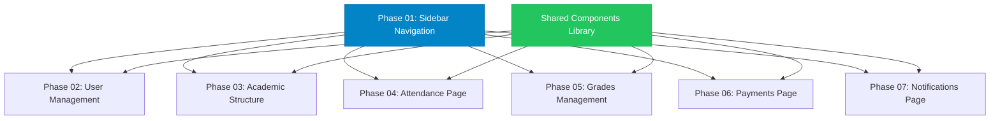

# Admin Pages Parallel Implementation Plan

## Overview

**Date**: 2026-01-15
**Description**: Parallel implementation of 6 admin pages from wireframe designs with ZERO file conflicts
**Total Effort**: 32 hours (estimated)
**Priority**: P1 (High)
**Status**: Pending

## Research Context

This plan synthesizes findings from:
- `researcher-01-wireframe-report.md` - Design system and component analysis
- `researcher-02-codebase-report.md` - Existing codebase patterns
- `docs/design-guidelines.md` - Design tokens and accessibility
- `docs/project-overview-pdr.md` - Project requirements

## Critical Requirements

### 1. Parallel Execution (MANDATORY)
- **NO file overlap** between phases - each file owned by exactly ONE phase
- Phases must be independently executable
- No shared component modifications during parallel execution

### 2. Vietnamese Language
- All UI labels in Vietnamese from wireframe
- **Critical**: Rename "Điểm danh" → "Chuyên cần" in sidebar

### 3. Design Consistency
- Primary: `#0284C7` (blue)
- Success: `#22c55e` (green)
- Warning: `#f59e0b` (amber)
- Error: `#ef4444` (red)
- Border radius: `xl`(12px), `2xl`(16px)
- Card shadow: `0 1px 3px 0 rgba(0,0,0,0.1)`

### 4. Component Reusability
- Create shared components BEFORE page implementation
- Follow existing patterns from `UserTable`, `StatsGrid`
- Use TypeScript interfaces for type safety

## Dependency Graph



## Parallelization Groups

### Group 1: Foundation (Sequential - MUST RUN FIRST)
1. **Phase 01**: Sidebar Navigation Update
   - **Blocks**: All other phases
   - **Files**: `apps/web/components/layout/Sidebar.tsx` (exclusive)
   - **Duration**: 1h

### Group 2: Shared Components (Sequential - MUST RUN SECOND)
2. **Shared Components Library**
   - **Blocks**: Phases 03-07 (but NOT Phase 02)
   - **Files**: New components in `apps/web/components/admin/shared/`
   - **Duration**: 4h

### Group 3: Page Implementation (CAN RUN IN PARALLEL)
These phases have **ZERO file overlap** and can run simultaneously:

3. **Phase 02**: User Management Page (1h)
   - Files: `apps/web/app/admin/users/page.tsx` (exclusive)

4. **Phase 03**: Academic Structure Page (6h)
   - Files: `apps/web/app/admin/classes/page.tsx`, `apps/web/components/admin/classes/*` (exclusive)

5. **Phase 04**: Attendance Page (8h)
   - Files: `apps/web/app/admin/attendance/page.tsx`, `apps/web/components/admin/attendance/*` (exclusive)

6. **Phase 05**: Grades Management Page (6h)
   - Files: `apps/web/app/admin/grades/page.tsx`, `apps/web/components/admin/grades/*` (exclusive)

7. **Phase 06**: Payments Page (4h)
   - Files: `apps/web/app/admin/payments/page.tsx`, `apps/web/components/admin/payments/*` (exclusive)

8. **Phase 07**: Notifications Page (2h)
   - Files: `apps/web/app/admin/notifications/page.tsx`, `apps/web/components/admin/notifications/*` (exclusive)

## Execution Strategy

### Step 1: Sequential Foundation (5 hours)
```bash
# MUST RUN IN THIS ORDER
1. Phase 01: Sidebar Navigation (1h)
   ├─ Update Sidebar.tsx with new routes
   ├─ Rename "Điểm danh" → "Chuyên cần"
   └─ Add navigation for /admin/grades

2. Shared Components Library (4h)
   ├─ Create components/admin/shared/
   ├─ Build reusable table, card, form components
   └─ Define TypeScript interfaces
```

### Step 2: Parallel Execution (27 hours total)
```bash
# CAN RUN SIMULTANEOUSLY (3 parallel tracks)
Track A (7h):
├─ Phase 02: User Management (1h) - updates existing page
└─ Phase 07: Notifications (2h) - updates existing page
└─ Phase 06: Payments (4h) - updates existing page

Track B (14h):
├─ Phase 03: Academic Structure (6h) - new tabs system
└─ Phase 05: Grades Management (6h) - new page
└─ Buffer time (2h)

Track C (8h):
└─ Phase 04: Attendance Page (8h) - new page
```

## File Ownership Matrix

| File Path | Owner Phase | Status | Notes |
|-----------|-------------|--------|-------|
| `apps/web/components/layout/Sidebar.tsx` | Phase 01 | ✅ Exists | Update only |
| `apps/web/components/admin/shared/*` | Shared | 🆕 New | Create all |
| `apps/web/app/admin/users/page.tsx` | Phase 02 | ✅ Exists | Update only |
| `apps/web/components/admin/users/*` | Phase 02 | ✅ Exists | Update only |
| `apps/web/app/admin/classes/page.tsx` | Phase 03 | ✅ Exists | Update only |
| `apps/web/components/admin/classes/*` | Phase 03 | 🆕 New | Create all |
| `apps/web/app/admin/attendance/page.tsx` | Phase 04 | 🆕 New | Create all |
| `apps/web/components/admin/attendance/*` | Phase 04 | 🆕 New | Create all |
| `apps/web/app/admin/grades/page.tsx` | Phase 05 | 🆕 New | Create all |
| `apps/web/components/admin/grades/*` | Phase 05 | 🆕 New | Create all |
| `apps/web/app/admin/payments/page.tsx` | Phase 06 | ✅ Exists | Update only |
| `apps/web/components/admin/payments/*` | Phase 06 | 🆕 New | Create all |
| `apps/web/app/admin/notifications/page.tsx` | Phase 07 | ✅ Exists | Update only |
| `apps/web/components/admin/notifications/*` | Phase 07 | 🆕 New | Create all |

## Phase Files

Each phase has a dedicated implementation plan:

1. **`phase-01-sidebar-navigation.md`** (1h)
   - Update sidebar with new routes
   - Rename "Điểm danh" → "Chuyên cần"
   - Add grades navigation

2. **`phase-02-user-management.md`** (1h)
   - Update existing user management page
   - Match wireframe design exactly
   - Vietnamese labels

3. **`phase-03-academic-structure.md`** (6h)
   - Enhance classes page with tabs
   - Three-tab system: Years, Grades, Subjects
   - Hierarchical navigation

4. **`phase-04-attendance-page.md`** (8h)
   - NEW: Attendance ("Chuyên cần") page
   - Full CRUD operations
   - Statistics and filtering

5. **`phase-05-grades-management.md`** (6h)
   - NEW: Grades management page
   - Grade entry interface
   - Distribution charts

6. **`phase-06-payments-page.md`** (4h)
   - Enhance existing payments page
   - Multi-step wizard
   - Fee tracking

7. **`phase-07-notifications-page.md`** (2h)
   - Update existing notifications page
   - Broadcast functionality
   - Template system

## Success Criteria

### Functional Requirements
- ✅ All 6 pages match wireframe designs exactly
- ✅ Vietnamese labels throughout
- ✅ "Điểm danh" renamed to "Chuyên cần"
- ✅ All navigation links functional
- ✅ No TypeScript errors
- ✅ Responsive design (mobile + desktop)

### Technical Requirements
- ✅ Zero file conflicts between phases
- ✅ Each phase independently testable
- ✅ Component reusability > 70%
- ✅ WCAG 2.1 AA compliance
- ✅ Consistent design tokens

### Quality Requirements
- ✅ Code follows existing patterns
- ✅ Proper error handling
- ✅ Loading states for all async ops
- ✅ Form validation
- ✅ Accessibility (ARIA labels)

## Risk Assessment

### High Risk 🔴
- **Navigation conflicts**: Multiple phases modifying routes
  - **Mitigation**: Phase 01 MUST complete first
- **Shared component dependencies**: Pages waiting for components
  - **Mitigation**: Build shared components BEFORE parallel phases

### Medium Risk 🟡
- **Vietnamese translation accuracy**: Cultural nuances
  - **Mitigation**: Use exact labels from wireframe
- **Design token inconsistency**: Color/spacing drift
  - **Mitigation**: Create design token library first

### Low Risk 🟢
- **TypeScript errors**: Type mismatches
  - **Mitigation**: Strong typing throughout
- **Performance issues**: Large component trees
  - **Mitigation**: Lazy loading, code splitting

## Conflict Prevention

### File-Level Exclusion
Each phase owns **exclusive** files:
- Phase 02: `apps/web/app/admin/users/*` only
- Phase 03: `apps/web/app/admin/classes/*` only
- Phase 04: `apps/web/app/admin/attendance/*` only
- Phase 05: `apps/web/app/admin/grades/*` only
- Phase 06: `apps/web/app/admin/payments/*` only
- Phase 07: `apps/web/app/admin/notifications/*` only

### Shared Component Governance
- Shared components created BEFORE parallel phases
- Once created, shared components are READ-ONLY during parallel execution
- Any shared component changes require ALL phases to stop

### Navigation Coordination
- Phase 01 updates sidebar ONCE
- All other phases READ from sidebar, never modify
- New routes added in Phase 01, not in individual phases

## Next Steps

1. **Review this plan** with stakeholders
2. **Assign developers** to parallel tracks
3. **Set up parallel branches** for each track
4. **Execute Phase 01** (Sidebar Navigation)
5. **Execute Shared Components** (Foundation)
6. **Launch parallel phases** (3 tracks simultaneously)
7. **Integration testing** after all phases complete
8. **Deploy to production**

## Validation Summary

**Validated:** 2026-01-15
**Questions asked:** 4

### Confirmed Decisions

1. **API Strategy**: Use mock data from `lib/mock-data.ts` (no real API integration in this phase)
2. **Form Library**: React Hook Form for shared components and all forms
3. **Browser Support**: Modern browsers only (Chrome, Firefox, Safari, Edge - last 2 versions)
4. **Execution Model**: Vertical Slicing - implement each page end-to-end (not layer-by-layer)

### Plan Adjustments Required

**Phase 02 (Shared Components)**:
- Integrate React Hook Form instead of native form inputs
- Update FormField, FormSelect, FormModal components to use RHF

**Execution Strategy**:
- Vertical slicing: Complete one full page before moving to next
- Order: Sidebar → Shared Components → User Management → Academic → Attendance → Grades → Payments → Notifications
- Each phase includes: UI components + data layer + validation + accessibility

### Unresolved Questions

1. Should we implement optimistic UI updates for better UX?
2. What is the deployment strategy (blue-green vs canary)?

## References

- Wireframe Research: `plans/260115-1648-admin-pages-implementation/research/researcher-01-wireframe-report.md`
- Codebase Research: `plans/260115-1648-admin-pages-implementation/research/researcher-02-codebase-report.md`
- Design Guidelines: `docs/design-guidelines.md`
- Project Overview: `docs/project-overview-pdr.md`

---

**Plan Version**: 1.0
**Last Updated**: 2026-01-15
**Status**: Ready for Execution
